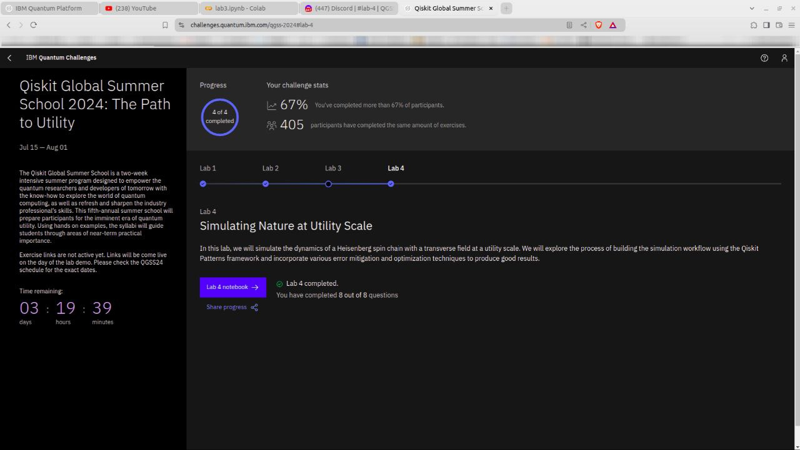
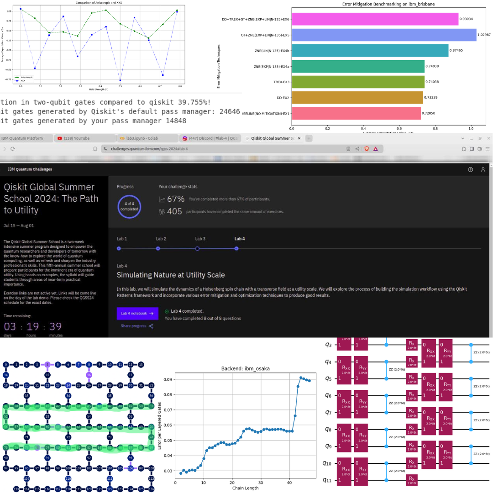

<!--  -->



# IBM Qiskit Global Summer School 2024 Solution


This repository includes my solution for the QGSS 2024. Below is the list of labs I completed. Each notebook is properly documented. To run, first install the required packages. Keep in mind that the graders won't work for you. And you will need an API token from IBM Quantum if you wish to run on real Quantum Hardware.

- Lab 1: Quantum Circuit Transpilation
- Lab 2: Utility-Scale Layer Fidelity Experiment
- Lab 3: Quantum Error Suppression and Mitigation with Qiskit Runtime
- Lab 4: Simulating Nature at Utility Scale

```bash
# Install Qiskit and relevant packages, if needed
pip install qiskit[visualization]==1.1.0 -q
# Use the following if you are on MacOS/zsh
#!pip install 'qiskit[visualization]'==1.1.0
pip install qiskit_ibm_runtime qiskit_aer -q
pip install matplotlib -q
pip install pylatexenc -q
pip install networkx -q
pip install git+https://github.com/qiskit-community/Quantum-Challenge-Grader.git -q
```

|   :warning:   |              Graders won't work for you               |
|---------------|:------------------------------------------------------|


|    :memo:     |   You will need an API token from IBM quantum to run on real Quantum Hardware    |
|---------------|:----------------------------------------------------------------------------------|

<!--  -->


